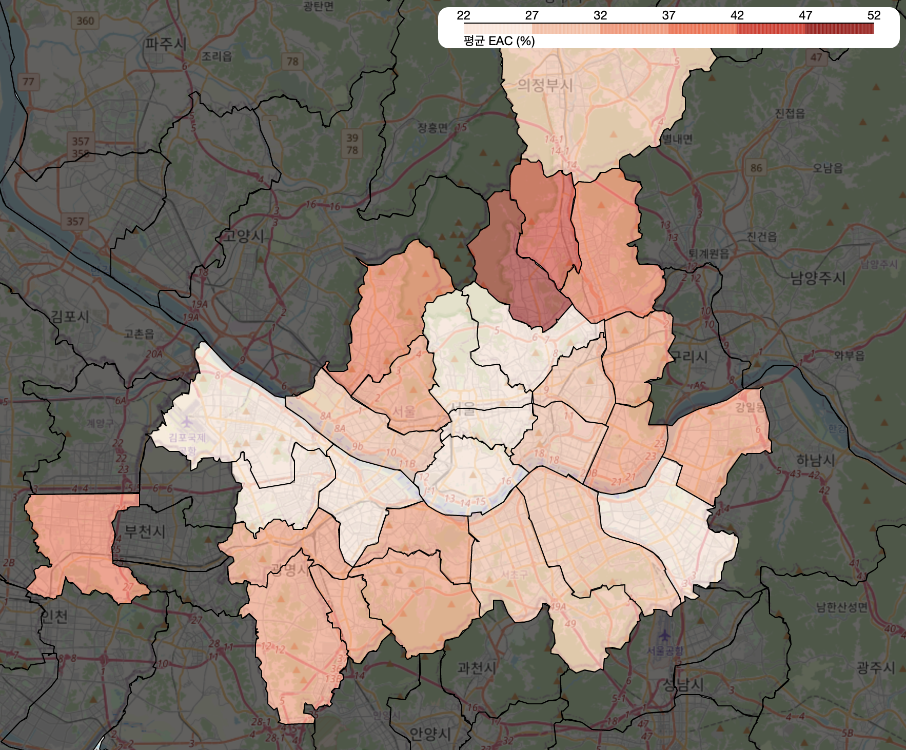
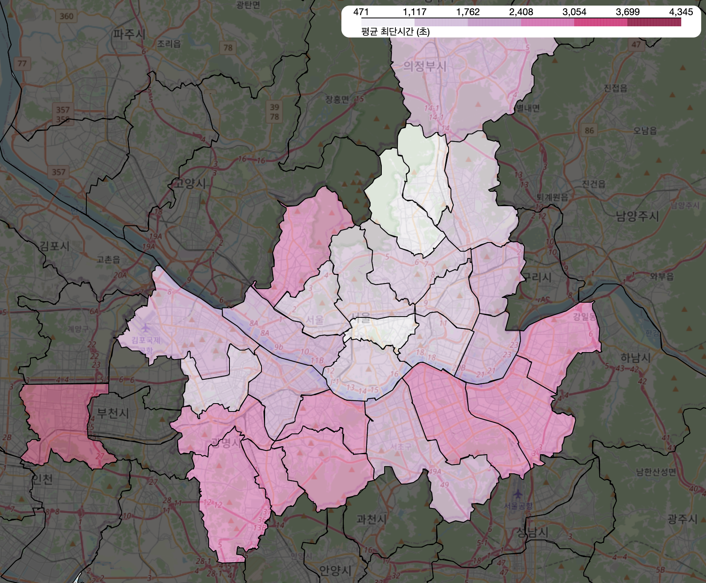
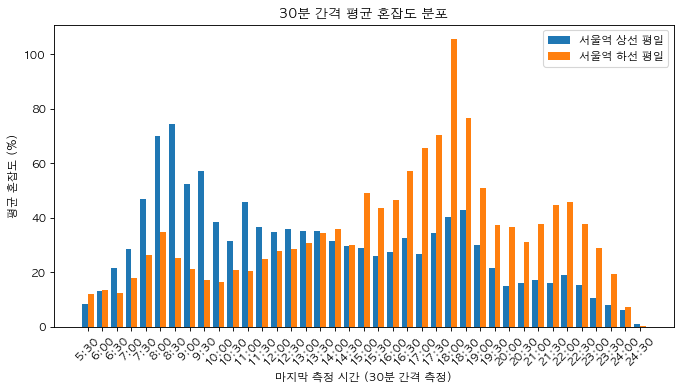
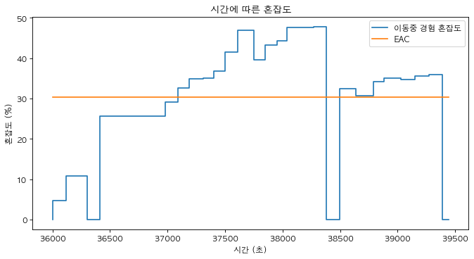
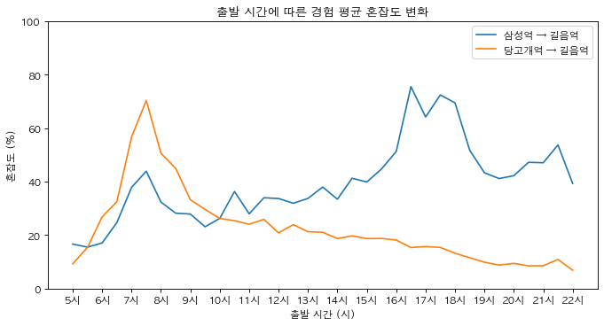
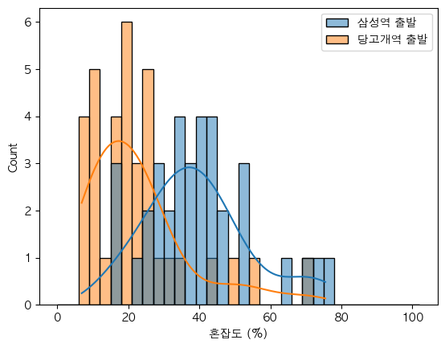
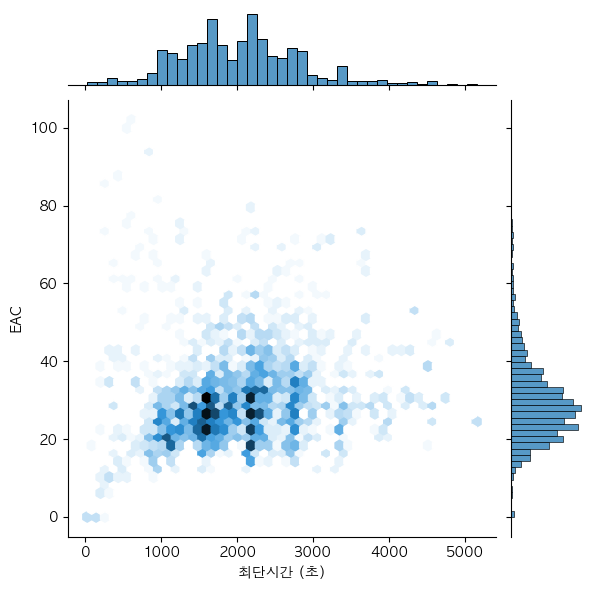
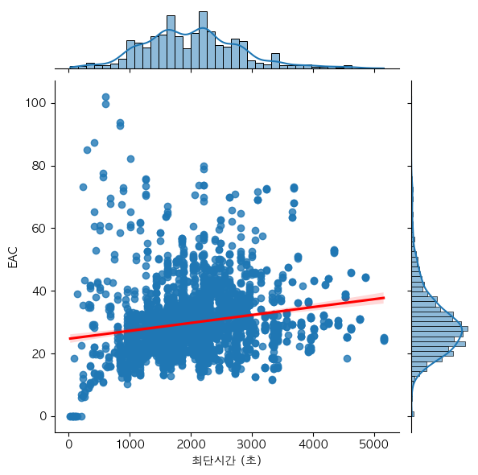
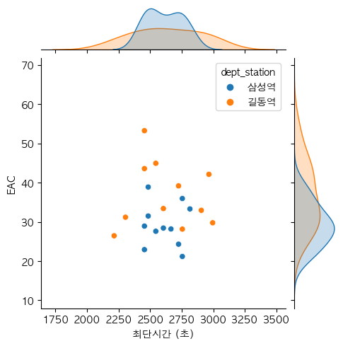

# Kookmin-Univ-commuting-congestion-analysis

Data analysis of public transportation congestion on commuting to Kookmin University

- Final Report
  - [지하철을 이용한 국민대학교 등하교시 혼잡도에 대한 분석.pdf](./%EC%A7%80%ED%95%98%EC%B2%A0%EC%9D%84%20%EC%9D%B4%EC%9A%A9%ED%95%9C%20%EA%B5%AD%EB%AF%BC%EB%8C%80%ED%95%99%EA%B5%90%20%EB%93%B1%ED%95%98%EA%B5%90%EC%8B%9C%20%ED%98%BC%EC%9E%A1%EB%8F%84%EC%97%90%20%EB%8C%80%ED%95%9C%20%EB%B6%84%EC%84%9D.pdf)
- Data analysis
  - [Train_crowdedness_analysis.ipynb](./Train_crowdedness_analysis.ipynb)

## Figures

|  |  |
| ------------------------ | ------------------------ |
|  |  |
|  |  |
|  |  |
|  |                          |
